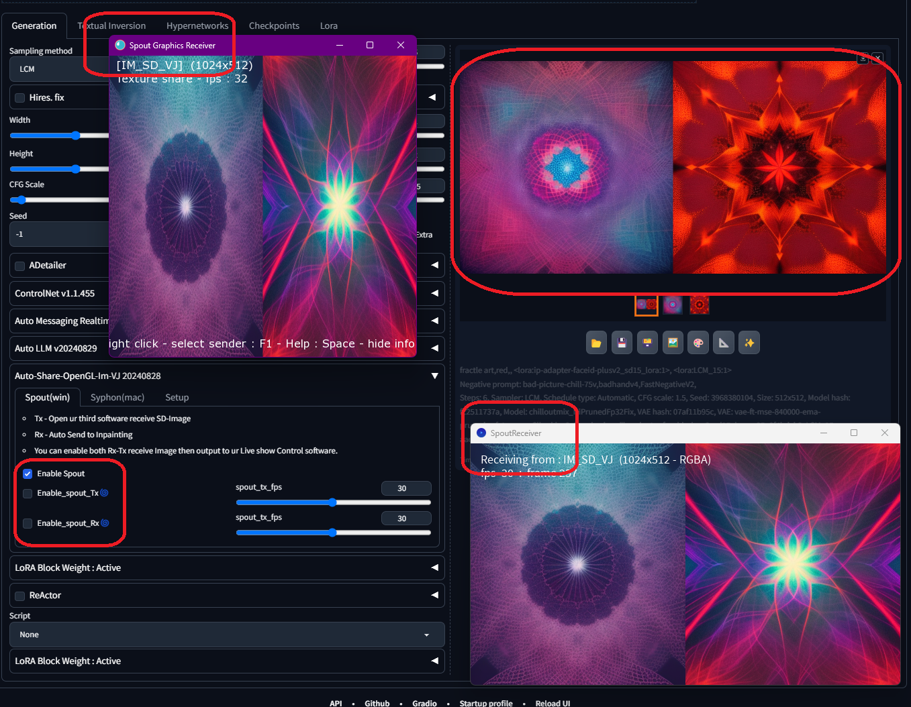
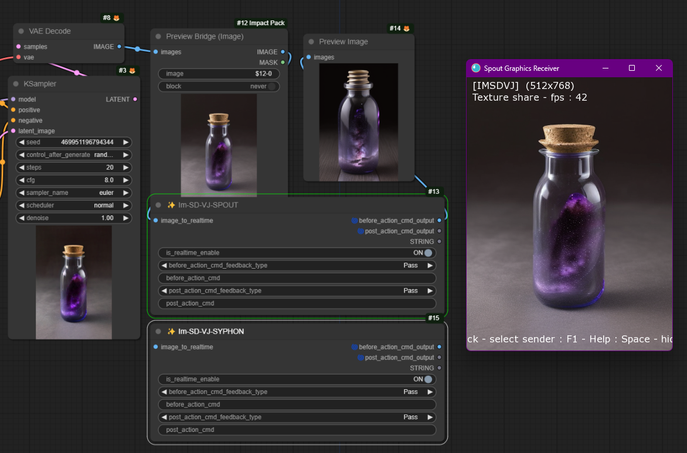
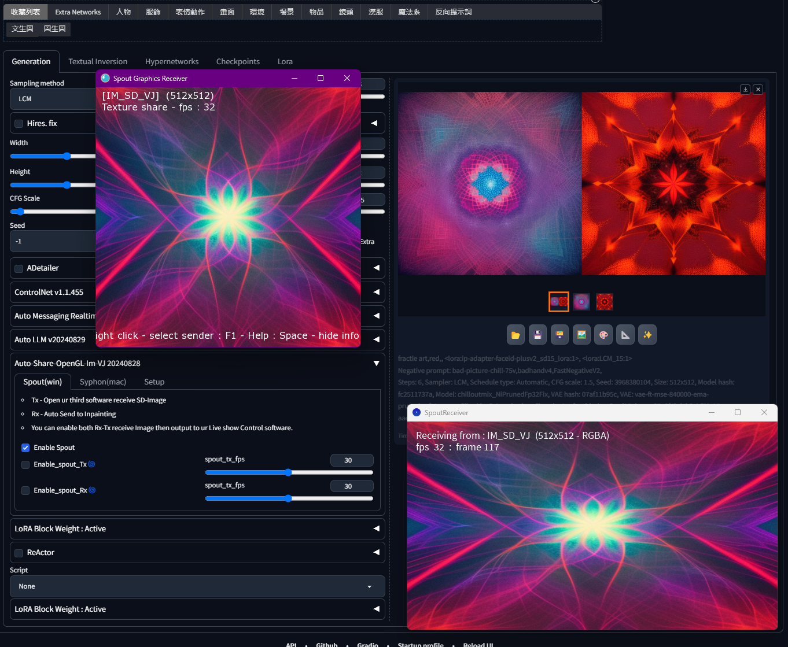
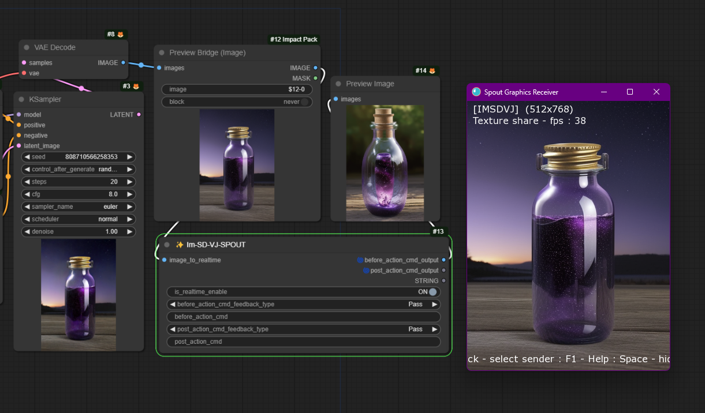
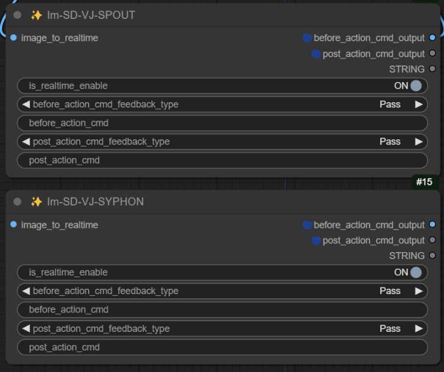

### Quick Links
* I'm SD-VJ. (share SD-generating-process in realtime by gpu) 
    * SD-WEB-UI: https://github.com/xlinx/sd-webui-decadetw-spout-syphon-im-vj
    * ComfyUI:   https://github.com/xlinx/ComfyUI-decadetw-spout-syphon-im-vj
* Auto prompt by LLM and LLM-Vision (Trigger more details out inside model) 
    * SD-WEB-UI: https://github.com/xlinx/sd-webui-decadetw-auto-prompt-llm
    * ComfyUI:   https://github.com/xlinx/ComfyUI-decadetw-auto-prompt-llm
* Auto msg to ur mobile  (LINE | Telegram | Discord)
  * SD-WEB-UI :https://github.com/xlinx/sd-webui-decadetw-auto-messaging-realtime
  * ComfyUI:  https://github.com/xlinx/ComfyUI-decadetw-auto-messaging-realtime
* CivitAI Info|discuss:
  * https://civitai.com/articles/6988/extornode-using-llm-trigger-more-detail-that-u-never-thought
  * https://civitai.com/articles/6989/extornode-sd-image-auto-msg-to-u-mobile-realtime

# SD-WEB-UI | ComfyUI | decadetw-spout-syphon-im-vj

  

  
   
  
 

#### Update Log
  * [add|202400822] | 🟢 spout support
  * [add|2024008xx] | 🟠 syphon support
  * [add|2024008xx] | 🟠 ofxNDI
  * 🟢 SD-Image(latent space) -> Spout(win)|(mac)Syphon -> GPU Memory -> Other Software (Ultra-fast-access)
  * 🟠 SD-Inpainting use <- GPU Memory <- Spout(win)|(mac)Syphon <- Other Software

## Motivation💡
* Live Performances & ...and show control cues.
  * QLab https://qlab.app/
  * vjdj | madmapper | processing | JAVA ....etc.,
  * https://madmapper.com/
  * https://processing.org/

* Enjoy ur party or project 
* I'm VJ(Visual Jockey)
* Interface, middle-ware between SD and Spout lib (https://spoutgl-site.netlify.app/#CClass:Spout)
* SD-Image to OpenGL in realtime 

##  Web-UI | Forge | ComfyUI preview
<table style="border-width:0px" >
<tr>
    <td>
        
    </td>
    <td>
       
    </td>
 </tr>
</table>

<table style="border-width:0px" >
<tr>
    <td>
        <b style="font-size:20px">Input</b>
    </td>
    <td>
       <b style="font-size:20px">Output</b>
    </td>
 </tr>
 <tr>
    <td> 
        <b style="font-size:30px">Spout / Win </b> 
        

        <li style="font-size:14px">Tx </li>
            <li style="font-size:14px; text-indent: 1em;">SD-Image -> 3rd software</li>
        <li style="font-size:14px">Rx </li>
        <li style="font-size:14px; text-indent: 1em;">3rd software (maybe webcam) -> SD-Img2Img</li>
    </td>
    <td>
        
            

        
    </td>
 </tr>
 <tr>
    <td> 
        <b style="font-size:20px">Syphon / Mac</b> 
        

        <b style="font-size:14px">@Mac using Syphon (later. finding M series mac ing...)</b>
    </td>
    <td>
        
    </td>
 </tr>

</table>

## Installtion

* You need install Spout or Syphon Client first.
  * https://github.com/leadedge/Spout2/releases/download/2.007.015/SPOUT_2007-015.zip
  * https://spout.zeal.co/

## Reference

* re-compiler for SD python env 3.10 | 3.11 
  * SpoutGL https://github.com/jlai/Python-SpoutGL/tree/main/VS2019

## How to show high-quality previews?
* Edit the "run_nvidia_gpu.bat" file with "--preview-method auto" on the end.
* If you have ComfyUI Manager Menu installed and just change on "Preview method"
* Use --preview-method auto to enable previews.

* The default installation includes a fast latent preview method that's low-resolution. To enable higher-quality previews with TAESD, download the taesd_decoder.pth, taesdxl_decoder.pth, taesd3_decoder.pth and taef1_decoder.pth and place them in the models/vae_approx folder. Once they're installed, restart ComfyUI and launch it with --preview-method taesd to enable high-quality previews.

##  Suggestion software info list

* https://syphon.github.io/ (Mac)
  * https://github.com/Syphon/Syphon-Framework
* https://spout.zeal.co/ (Win)
  * https://github.com/leadedge/Spout2
* https://github.com/leadedge/ofxNDI (Net)

### Suggestion LLM Model in VJ mode

* LLM-text (normal, chat, assistant)
    * 4B VRAM<2G
        * CHE-72/Qwen1.5-4B-Chat-Q2_K-GGUF/qwen1.5-4b-chat-q2_k.gguf
            * https://huggingface.co/CHE-72/Qwen1.5-4B-Chat-Q2_K-GGUF
    * 7B VRAM<8G
        * ccpl17/Llama-3-Taiwan-8B-Instruct-GGUF/Llama-3-Taiwan-8B-Instruct.Q2_K.gguf
        * Lewdiculous/L3-8B-Stheno-v3.2-GGUF-IQ-Imatrix/L3-8B-Stheno-v3.2-IQ3_XXS-imat.gguf
    * Google-Gemma
        * https://huggingface.co/bartowski/gemma-2-9b-it-GGUF
        * bartowski/gemma-2-9b-it-GGUF/gemma-2-9b-it-IQ2_M.gguf
            * small and good for SD-Prompt

* LLM-vision 👀 (work with SDXL, VRAM >=8G is better )
    * https://huggingface.co/xtuner/llava-phi-3-mini-gguf
        * llava-phi-3-mini-mmproj-f16.gguf (600MB,vision adapter)
        * ⭐⭐⭐llava-phi-3-mini-f16.gguf (7G, main model)
    * https://huggingface.co/FiditeNemini/Llama-3.1-Unhinged-Vision-8B-GGUF
        * llava-llama-3.1-8b-mmproj-f16.gguf
        * ⭐⭐⭐Llama-3.1-Unhinged-Vision-8B-Q8.0.gguf
    * https://huggingface.co/Lewdiculous/Eris_PrimeV4-Vision-32k-7B-GGUF-IQ-Imatrix#quantization-information
      * quantization_options = ["Q4_K_M", "Q4_K_S", "IQ4_XS", "Q5_K_M", "Q5_K_S","Q6_K", "Q8_0", "IQ3_M", "IQ3_S", "IQ3_XXS"]
      * ⭐⭐⭐⭐⭐for low VRAM **super small**: IQ3_XXS (2.83G)
      * in fact, it's enough uses.

        
## Fixing Spout Post-Build
    By default the spout build config will try to copy to a non-existent Binaries/x64 folder. Fix this by:
    Clicking on SpoutSDK in the Visual Studio Solutions Explorer, and choosing Properties
    Choose BuildEvents->Post-Build Event
    Delete the Command Line option
    Click Apply

## Buy me a Coca cola ☕

https://buymeacoffee.com/xxoooxx

## Colophon

Made for fun. I hope if brings you great joy, and perfect hair forever. Contact me with questions and comments, but not
threats, please. And feel free to contribute! Pull requests and ideas in Discussions or Issues will be taken quite
seriously!
--- https://decade.tw

